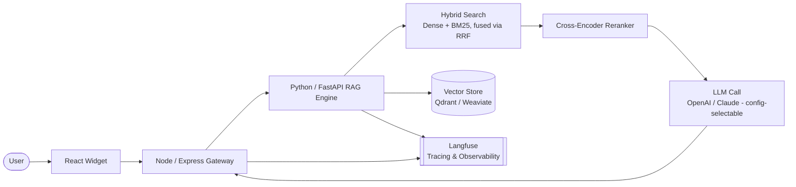

# Docent

**An AI assistant that answers questions from your documentation**

[](https://github.com/YOUR-ORG/docent/actions/workflows/ci.yml)
[](https://opensource.org/licenses/MIT)
[](#)
[](#)

---

## Why this exists

Most "AI chatbot for your docs" plugins skip the part that actually matters: knowing whether the answers are any good. They hallucinate quietly, degrade over time as content changes, and nobody notices until a real user gets a confidently wrong answer.

Docent is built the other way around. Retrieval uses hybrid search and reranking. Every answer is graded against a maintained evaluation set before it ships, not just spot-checked by eye. Production traffic is traced and monitored, not left to run silently. It's a small project, deliberately built to the standard a real client-facing system needs to meet.

## Live demo

🔗 `[link to live deployment]`

`[demo GIF / screenshot placeholder]`

## Architecture



## Features

- **Hybrid retrieval** — dense vector search + sparse/BM25 keyword search, fused with Reciprocal Rank Fusion, instead of vector-only similarity
- **Cross-encoder reranking** — filters the retrieved set down to what's actually relevant before it reaches the model, avoiding the "lost in the middle" failure mode
- **Source-cited answers** — every response links back to the document it came from
- **Multi-provider LLM support** — OpenAI and Anthropic Claude behind a single config-swappable interface
- **Confidence-aware fallback** — declines to answer or asks a clarifying question when retrieval relevance is low, rather than guessing
- **Eval-gated CI** — every pull request is scored against a maintained golden dataset (Ragas + DeepEval); regressions block the merge
- **Production observability** — Langfuse tracing on every request: token cost, latency, retrieval quality, live scoring on real traffic
- **Config-driven ingestion** — the knowledge base is a swappable input, not a hardcoded dataset, so the same engine can be repointed at new content
- **Prompt-injection aware** — retrieved content is treated as untrusted data, never as instructions

## Tech stack

| Layer | Technology | Why |
|---|---|---|
| Widget | React | Standalone, embeddable — not coupled to any one host site |
| Docs site | Docusaurus v3 | Source of the demo knowledge base |
| API gateway | Node.js + Express | Auth, rate limiting, request logging |
| RAG engine | Python + FastAPI | Ingestion, hybrid retrieval, reranking, generation |
| Vector store | Qdrant / Weaviate | Native hybrid (dense + sparse) query support |
| Reranker | Cohere Rerank / BGE-reranker | Cross-encoder relevance filtering |
| Evaluation | Ragas + DeepEval | Offline tuning + CI quality gate |
| Observability | Langfuse | Production tracing and live scoring |
| Testing | Jest/Vitest, pytest, Playwright | Unit, integration, end-to-end |
| Security | CodeQL, Trivy, Syft | SAST, dependency/container scanning, SBOM |
| CI/CD | GitHub Actions | Hardened, staged rollout, automatic rollback |

## Project structure

```
docs-site/          Docusaurus app — real docs content lives in docs-site/docs
api-gateway/         Node/Express service
ai-service/          Python/FastAPI RAG engine
.github/workflows/   CI and CD pipeline definitions
README.md
```

## Getting started

### Prerequisites
- Node.js 18+
- Python 3.11+
- Docker & Docker Compose
- API keys: OpenAI and/or Anthropic, plus a reranker key if using a hosted option

### Setup
```bash
git clone https://github.com/Shoaib-Asghar/docent.git
cd docent

# Docs site
cd docs-site && pnpm install

# API gateway
cd ../api-gateway && pnpm install

# AI service
cd ../ai-service
python -m venv venv && source venv/bin/activate
pip install -r requirements.txt

# Environment variables — fill in API keys and config
cp .env.example .env
```

### Run locally
```bash
docker compose up          # vector store + backend services
pnpm run start --filter docs-site
```

## Testing & evaluation

Four layers, run together, not treated as separate concerns:

1. **Unit tests** — retrieval logic, Express routes
2. **Integration tests** — full request path across services
3. **Eval harness** — a 50–200 query golden dataset scored against faithfulness, answer relevancy, context precision, and context recall
4. **End-to-end** — Playwright, simulating a real user on the live site

| Metric | Tool | Current score |
|---|---|---|
| Faithfulness | Ragas | `TBD — filled in after first eval run` |
| Answer relevancy | Ragas | `TBD` |
| Context precision | Ragas | `TBD` |
| Context recall | Ragas | `TBD` |
| CI eval gate | DeepEval | `Passing / Failing` |
| Test coverage | pytest-cov / Jest | `TBD%` |

## CI/CD pipeline

```mermaid
flowchart LR
    PR[Pull Request] --> Lint[Lint]
    Lint --> Tests[Unit + Integration + E2E]
    Tests --> Eval[Eval Gate: Ragas + DeepEval]
    Eval --> Sec[SAST + Dependency + Container Scan]
    Sec --> SBOM[Generate SBOM]
    SBOM --> Merge{Merge to main}
    Merge --> Build[Build & Scan Images]
    Build --> Staging[Deploy: Staging]
    Staging --> Smoke[Smoke Test]
    Smoke --> Prod[Staged / Canary Production Deploy]
    Prod --> Monitor[Langfuse + Health Checks]
    Monitor -->|failure| Rollback[Automatic Rollback]
```



A pull request with a failing test, a regressed eval score, or a critical security finding is blocked automatically. A clean merge deploys through a staged rollout with no manual steps, and a failed post-deploy health check triggers an automatic rollback.

## Security

Retrieved content is always treated as untrusted data, never as instructions — the system prompt explicitly separates developer instructions from retrieved context to defend against indirect prompt injection (OWASP LLM01). Requests are rate-limited per session, no secrets are stored in source control, and query/response data is logged for a defined retention window to support incident review if something goes wrong.

## Roadmap

- [ ] Multi-tenant support — point the same engine at multiple clients' content
- [ ] Self-serve demo mode — paste your own content, try it live
- [ ] Additional LLM provider support

## License

MIT — see [LICENSE](./LICENSE)

## About

Built by **StuzaSoft** — a software studio specializing in production-grade AI integration, QA automation, and DevOps. [Get in touch →](#)